# System Flow Diagrams

## Score Update Flow (with Action Token Verification)


---

## Action Token Flow (Detail)

```mermaid
sequenceDiagram
    participant Game as Game/Action Service
    participant Backend as Scoreboard Backend
    participant Client as Client App
    
    Note over Game: User completes action (game level, quiz, etc.)
    
    Game->>Backend: POST /internal/actions/complete
    Note over Game,Backend: { action_id, user_id, max_score }
    
    Backend->>Backend: Generate signed token
    Note over Backend: payload = action_id:user_id:max_score:expires_at<br/>token = base64(payload):hmac(payload)
    
    Backend-->>Game: { action_token, expires_at }
    
    Game-->>Client: Action completed! Here's your token
    
    Note over Client: User sees "Score +100" button
    
    Client->>Backend: PATCH /api/v1/scores
    Note over Client,Backend: { action_token, score_delta: 100 }
    
    Backend->>Backend: Validate token
    Note over Backend: 1. Decode & parse<br/>2. Verify HMAC<br/>3. Check expiry<br/>4. Match user_id<br/>5. Check score_delta ≤ max_score<br/>6. Check not consumed
    
    Backend-->>Client: { new_total_score: 1500, rank: 5 }
```



---

## Leaderboard Retrieval Flow


---

## SSE Connection Flow


**Client Code:**
```javascript
const es = new EventSource('/api/v1/leaderboard/stream');
es.addEventListener('leaderboard', (e) => {
  updateUI(JSON.parse(e.data));
});
// Auto-reconnect on disconnect (built into EventSource)
```

---

## Session Validation Flow


---

## Multi-Server Architecture


---

## Error Handling Flow


---

## Data Consistency Flow


---

## Concurrent Update Handling


---

## Token Replay Prevention

